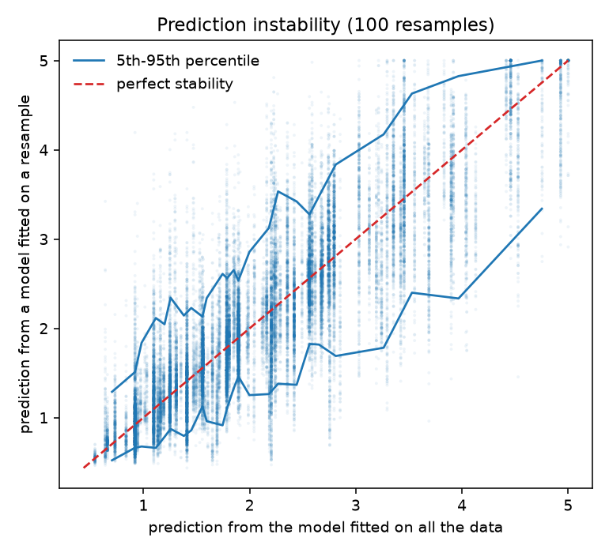
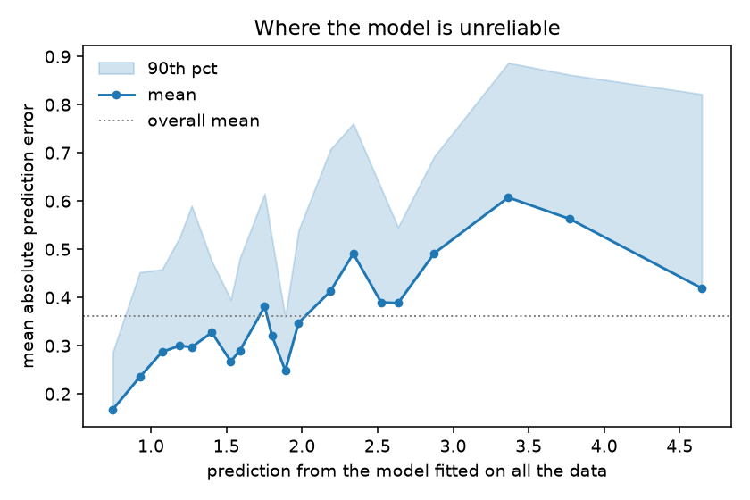
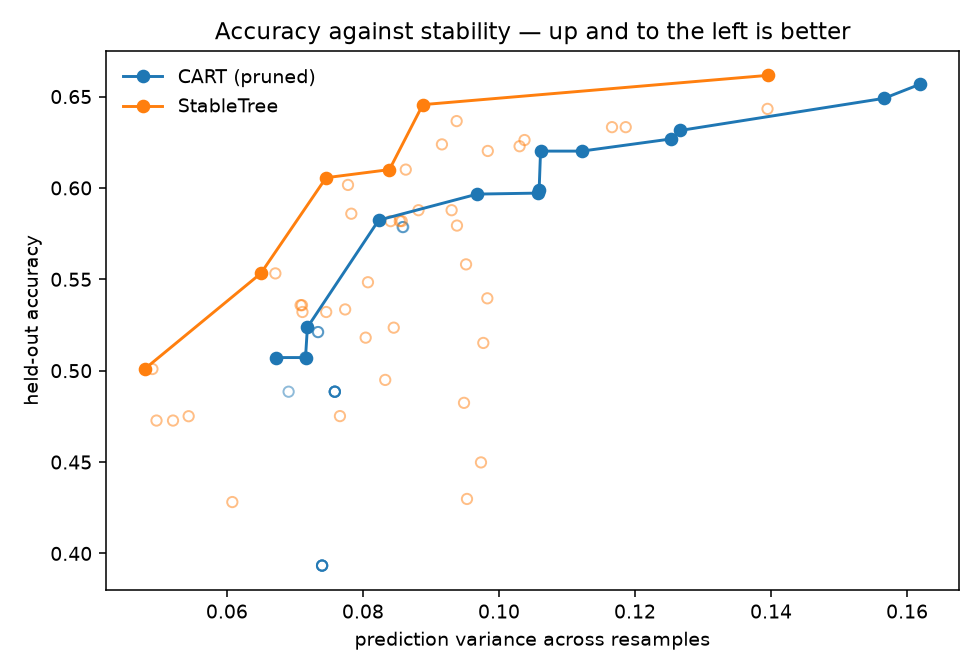

## stable-cart: measure and reduce the instability of a single tree

[](https://github.com/finite-sample/stable-cart/actions/workflows/ci.yml)
[](https://pypi.org/project/stable-cart/)
[](https://pepy.tech/project/stable-cart)
[](https://finite-sample.github.io/stable-cart/)
[](https://github.com/finite-sample/stable-cart/blob/main/LICENSE)
[](https://www.python.org/downloads/)

Fit a decision tree, resample the training data, fit it again. The second tree
predicts something different for the same person — often *very* different. That
movement is not sampling error in the estimate; it is a property of the
procedure, and if you have to ship one readable model rather than a forest, it
is your problem.

This package does two things about it:

1. **Measures it.** `bootstrap_instability` and `stability_frontier` implement
   the resampling protocol of [Riley and Collins (2023)](https://onlinelibrary.wiley.com/doi/full/10.1002/bimj.202200302),
   the standard way to report prediction instability. The R package
   `pminternal` implements it; scikit-learn had no equivalent.
2. **Reduces it**, without giving up the single tree. `StableTree` averages the
   *split decision* over bootstrap replicates instead of averaging predictions,
   so the output is still one tree you can read.

The frontier is the point. Instability alone is meaningless — a model that
ignores its training data scores a perfect zero — so every measurement here is
reported next to accuracy, and the tool returns the Pareto set rather than a
winner.



*California housing, depth-8 tree, 100 bootstrap resamples. Each dot is one
individual under one resampled model. A household predicted at $150k could just
as easily have been predicted anywhere from $90k to $230k.*

## Install

```bash
pip install stable-cart          # core: numpy + scikit-learn
pip install "stable-cart[plots]" # adds matplotlib for the three figures
```

## Quick start

### How unstable is my model?

Works on any scikit-learn estimator, not just the ones in this package.

```python
from sklearn.datasets import fetch_california_housing
from sklearn.model_selection import train_test_split
from sklearn.tree import DecisionTreeRegressor

from stable_cart import bootstrap_instability

X, y = fetch_california_housing(return_X_y=True)
X_train, X_test, y_train, y_test = train_test_split(X, y, random_state=0)

bootstrap_instability(
    lambda: DecisionTreeRegressor(max_depth=8, min_samples_leaf=10),
    X_train,
    y_train,
    X_test,
    n_bootstrap=50,
)
# {'instability_mean': 0.103, 'instability_p90': 0.238,
#  'instability_max': 1.255, 'mape': 0.275}
```

`mape` is Riley and Collins's headline: on average, a model fitted on a
resample predicts **$27.5k** away from what the model fitted on all the data
predicts for the same household — on a target whose values run from $15k to
$500k. `instability_max` says some household moves by $125k.

### What would it cost me to be more stable?

```python
from stable_cart import stability_frontier

result = stability_frontier(
    lambda **kw: DecisionTreeRegressor(min_samples_leaf=10, random_state=0, **kw),
    {"max_depth": [3, 5, 8], "ccp_alpha": [0.0, 0.005, 0.05]},
    X_train,
    y_train,
    n_bootstrap=20,
    random_state=0,
)

for point in result["frontier"]:
    print(
        f"R2={point['accuracy']:.3f}  instability={point['instability']:.3f}  {point['params']}"
    )

# R2=0.651  instability=0.107  {'ccp_alpha': 0.0,   'max_depth': 8}
# R2=0.594  instability=0.079  {'ccp_alpha': 0.0,   'max_depth': 5}
# R2=0.592  instability=0.078  {'ccp_alpha': 0.005, 'max_depth': 8}
# R2=0.583  instability=0.074  {'ccp_alpha': 0.005, 'max_depth': 5}
# R2=0.526  instability=0.057  {'ccp_alpha': 0.005, 'max_depth': 3}
# R2=0.483  instability=0.053  {'ccp_alpha': 0.05,  'max_depth': 8}
```

That is the exchange rate, stated: **halving the instability costs 12.5 points
of R²** on this data (0.107 → 0.057, 0.651 → 0.526). Whether that trade is
worth taking is not a question the package can answer, which is exactly why it
returns the set rather than a winner.

`frontier` holds the configurations no other configuration beats on *both*
axes. Everything else in `points` is dominated — strictly worse on accuracy or
stability or both — and knowing which is which is the whole exercise.

### Show me where it is unreliable

```python
from stable_cart import bootstrap_predictions, plot_mape_by_prediction

raw = bootstrap_predictions(
    lambda: DecisionTreeRegressor(max_depth=8, min_samples_leaf=10, random_state=0),
    X_train,
    y_train,
    X_test,
    n_bootstrap=100,
    random_state=0,
)
plot_mape_by_prediction(raw)
```



Instability is not spread evenly. On this data it roughly quadruples between the
cheapest and most expensive predictions — an average of 0.36 hides a model that
is nearly four times less trustworthy at the top of its range.

### A tree whose splits are averaged

```python
from stable_cart import StableTree

tree = StableTree(
    task="regression",
    max_depth=5,
    n_consensus=12,  # bootstrap replicates per split decision
    consensus_threshold=0.3,  # a split needs this share of the vote, or the node becomes a leaf
    leaf_shrinkage=5.0,  # pull leaf values toward the parent
    random_state=0,
).fit(X_train, y_train)

tree.split_supports()  # [1.0, 0.83, 0.58, ...] — how reproducible each split was
tree.stop_reasons_  # Counter({'max_depth': 12, 'no_reproducible_split': 3})
```

At each node, `StableTree` resamples the node's rows `n_consensus` times, takes
the best split in each replicate, elects the feature by vote, and sets the cut
point to the **median** of the cut points that chose it. Cut-point variance is
the part of a tree that actually moves — [Geurts and Wehenkel (2000)](https://www.semanticscholar.org/paper/Investigation-and-Reduction-of-Discretization-in-Geurts-Wehenkel/c116336862b6ab82f6374ca869d6493dfca702cc)
found it high even at large sample sizes, and this package's own measurements
put threshold agreement at 2–22% while the root *feature* agrees 100% of the
time. A node whose winning feature cannot reach `consensus_threshold` becomes a
leaf: a split the data cannot reproduce is not one worth showing a reviewer.

## The frontier, both families on one set of axes



Both families sweep the same depths, so neither gets a complexity advantage.
Regenerate with `uv run python scripts/make_readme_figures.py`.

## What actually works

Every claim below is measured by a script in this repository. Where an earlier
version of this README claimed more, the retraction is in
[CHANGELOG.md](CHANGELOG.md).

| approach | effect on instability | keeps one readable tree? |
|---|---|---|
| **Averaging predictions** (random forest) | −62% to −92% | **no** — and that is the whole difficulty |
| **Pruning / depth limits** (`ccp_alpha`, `max_depth`) | the most reliable single-tree lever | yes |
| **Averaging the split decision** (`StableTree`) | −20% to −60% at equal or better accuracy **in noisy regimes**; ~1% when the signal is nearly noiseless | yes |
| **Leaf shrinkage** (`leaf_shrinkage`) | decisive when noise is high: the leaf component is 40–90% of prediction variance there, 2–11% when noise is low | yes |
| **Global/optimal search** (GOSDT) | **nothing measurable** at matched complexity | yes |
| **Picking the tree closest to the ensemble mean** (`CentroidTree`) | +18% against a random pick from the same pool; **nothing** against plain CART | yes |

Two consequences worth stating plainly. **Pruning is the baseline anything new
has to beat**, and it is one scikit-learn argument. And **which knob pays
depends on the noise level** — where the leaf component dominates, averaging the
split decision cannot help, because the structure was not the problem.

A third, less comfortable one. Run every estimator at *one fixed configuration*
across the 14 benchmark datasets — `make benchmark`, report in
[benchmark_results/](benchmark_results/comprehensive_benchmark_report.md) — and
the average variance reduction against plain CART is **−3.2%**. The stable
methods are, on average, no better. `StableTree` is the only one above water at
+16.8%, and a random forest beats all of them on every dataset while not being a
tree.

That is not a contradiction of the frontier table above; it is the reason the
frontier exists. A single default configuration is a point, and the gain lives
in *choosing* the point. If you take one thing from this package, make it
`stability_frontier` rather than any particular estimator.

## Which estimator do I reach for?

The package ships five estimators plus plain CART as the reference.
`experiments/frontier_eval.py` sweeps each one's own parameters on 14 datasets,
pools every configuration, and asks which ones land on the *joint* frontier —
the configurations no configuration of any family beats on both accuracy and
stability. A model that clears no usable accuracy floor is dropped first, so a
constant predictor cannot win by being perfectly stable.

| estimator | datasets with a frontier point | multi-class? | notes |
|---|---|---|---|
| **`StableTree`** | **11 / 14** | yes | start here |
| `DecisionTree*` + `ccp_alpha` (sklearn) | 7 / 14 | yes | the baseline, and it wins outright on `iris` |
| `CentroidTree` | 6 / 14 | yes | N× training cost; owns `digits_binary` and half of `xor_nonlinear` |
| `LessGreedyHybridTree` | 4 / 14 | **no** | the only frontier point on `california_housing` |
| `BootstrapVariancePenalizedTree` | 2 / 14 | **no** | |
| `RobustPrefixHonestTree` | 2 / 14 | **no** | two of three points on `california_housing` |

Read this as a map, not a leaderboard. Several arms appear on the same frontier
on most datasets, which means the curves cross and the operating point is your
choice. And three of the four older estimators raise on multi-class targets,
which is why they score zero on `wine`, `iris` and `digits_multiclass` — a
limitation, not a defeat.

Reproduce with `uv run python experiments/frontier_eval.py`.

## Development

```bash
uv sync --all-extras
uv run pytest
uv run ruff check . && uv run ruff format --check .
uv run pyright
```

Local CI mirrors the GitHub workflow: `make ci-docker`.

Scripts behind the numbers:

| script | what it produces |
|---|---|
| `scripts/param_effect.py` | which documented parameters can change a prediction |
| `scripts/make_readme_figures.py` | the three figures above |
| `experiments/frontier_eval.py` | every estimator on the joint accuracy-stability frontier |
| `experiments/variance_budget.py` | the leaf-versus-structure split of prediction variance |
| `experiments/optimal_tree_premise.py` | the matched-complexity comparison against GOSDT |
| `experiments/knob_study.py` | whether the measured variance budget predicts which knob to turn |

## Citation

```bibtex
@software{stable_cart,
  title  = {stable-cart: measuring and reducing decision tree prediction instability},
  author = {Sood, Gaurav and Bhosle, Arav},
  year   = {2026},
  url    = {https://github.com/finite-sample/stable-cart}
}
```

## Related work

- Riley and Collins, *Stability of clinical prediction models developed using
  statistical or machine learning methods*, Biometrical Journal 65(8), 2023 —
  the instability protocol implemented here, and the R package `pminternal`.
- Geurts and Wehenkel, *Investigation and reduction of discretization variance
  in decision tree induction*, ECML 2000 — threshold averaging.
- Breiman, *Bagging predictors*, 1996 — why averaging works, and what it costs.
- Athey and Imbens, *Recursive partitioning for heterogeneous causal effects*,
  PNAS 2016 — honest estimation.
- Vidal and Schiffer, *Born-again tree ensembles*, ICML 2020 — exact
  distillation of a forest into one tree.
- Marx, Calmon and Ustun, *Predictive multiplicity in classification*, ICML 2020
  — a different construct (multiplicity within the near-optimal set), and
  deliberately not implemented here.

## Changelog

See [CHANGELOG.md](CHANGELOG.md). **2.0 is a breaking release and corrects
results published in 1.1.0.**

## License

MIT — see [LICENSE](LICENSE).
